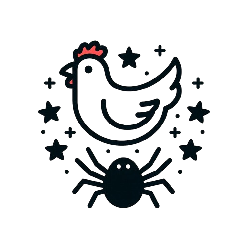

<h1 align="center">StarDreamSpider</h1>

<b>尝试将星星，鸡和蜘蛛结合起来</b>

星梦爬虫，这个名字真是，碉堡了。学习爬虫的一些小demo项目辣，嘿嘿嘿。
## 星梦Spider?
### 已实现
- 初始化仓库库，初步规划待办列表，

### 待完成
- 每日新闻提取：从指定平台的指定账号博客中自动提取当天的新闻。
- 每周新闻汇总：汇总一周内的新闻，生成周报。
- 多平台支持：支持多个博客平台的数据采集。
- 邮箱消息推送

- 掘金-HelloGithub-https://juejin.cn/user/1574156384091320
- 掘金-极客日报-https://juejin.cn/user/3839957080736808
- 掘金插件-github仓库榜单-
- 36kr-8点1氪-https://www.36kr.com/p/2833046194522374
- Github-topics-https://github.com/topics/python
- Github-trending-https://github.com/trending
- Github-collections-https://github.com/collections
- Github-events-https://github.com/events

## 数据库字段
| 来源 | 作者 | 链接   | 标题 |详情 |
|----|--|------|---|-|
|  source  | author | link   | title | detail|
| 掘金 | 极客日报 | 文章链接 |   ||
| 36kr | HelloGithub | 文章链接 |  | |